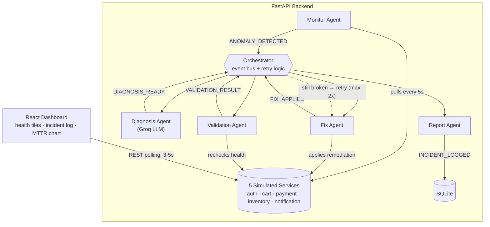

# Self-Healing E-Commerce Microservices

> Autonomous incident response for e-commerce microservices: AI agents detect, diagnose, fix, and verify failures — closed-loop, with zero human intervention and zero paid APIs.


---

## Live Demo

| | URL |
|---|---|
| **Dashboard** | https://self-healing-e-commerce-microservices-aax3tmiok-anshika494shiv.vercel.app |
| **API Docs** | https://self-healing-backend-m1e1.onrender.com/docs |

> First load may take 30–50 seconds — the free backend tier sleeps after inactivity and needs to wake up.

<details>
<summary>Known limitations of the free deployment</summary>

- Render's free tier spins down after 15 minutes of inactivity (first request takes 30–50s to wake it)
- Background tasks (the Monitor Agent) restart on wake-up, so recent history may be sparse right after a cold start
- The live deployment demonstrates the API and dashboard UI end-to-end; for the smoothest view of the full autonomous healing loop, run it locally
</details>

---

## What is this?

Real e-commerce platforms run as many small **microservices** — separate programs for login, cart, payments, inventory, and notifications. In production, these fail constantly: they crash, slow down, leak memory, or start throwing errors.

Today, one of two things happens when that occurs:

1. **A human gets paged** (PagerDuty, Datadog) and manually diagnoses and fixes it — slow, and costs 15–45+ minutes of downtime.
2. **A dumb auto-restart kicks in** (Kubernetes liveness probes) — fast, but blind. It applies the same fix to every problem and never understands *why* it broke.

This project builds the missing middle: a system that closes the full loop —

```
detect → diagnose → fix → verify → retry if needed → log
```

— using LLM reasoning and an event-driven multi-agent architecture, runnable on a single laptop for free.

**Research question:**
> Can a multi-agent, LLM-orchestrated system autonomously detect, diagnose, and recover microservice failures faster and more accurately than manual intervention — and what is the measurable reduction in Mean Time to Recovery (MTTR)?

---

## How it works



**Key design choice:** agents never call each other directly. They publish and subscribe to events on a lightweight in-process event bus — our own replacement for enterprise tools like Solace Agent Mesh. This keeps the system decoupled, testable, and is itself part of the research contribution.

### The 5 agents

| Agent | Does | Publishes |
|---|---|---|
| **Monitor** | Polls every service every 5s, flags anomalies against thresholds | `ANOMALY_DETECTED` |
| **Diagnosis** | Sends metrics to a Groq LLM, gets back root cause + confidence + fix | `DIAGNOSIS_READY` |
| **Fix** | Executes the chosen remediation action | `FIX_APPLIED` |
| **Validation** | Re-checks the service — did it actually recover? | `VALIDATION_RESULT` |
| **Report** | Writes the incident + MTTR to the database | `INCIDENT_LOGGED` |

The **Orchestrator** sequences these agents end-to-end and owns the retry loop (up to 2 retries with an alternate fix, then escalates).

---

## Why this is different

| Tool | What it does | What it's missing |
|---|---|---|
| Datadog / PagerDuty | Detects and alerts a human | Human still diagnoses and fixes manually |
| Kubernetes probes | Auto-restarts blindly | No root-cause understanding, same fix every time |
| RCAgent / OpenRCA | LLM diagnoses the root cause | Never acts on the diagnosis, never verifies |
| **This project** | Detects → diagnoses → fixes → verifies → retries | Closes the full loop, autonomously |

---

## Tech stack

| Layer | Technology | Why |
|---|---|---|
| Frontend | React 18 + Vite + Tailwind CSS | Fast, modern, portfolio-grade UI |
| Charts | Recharts | Clean, React-native charting |
| Backend | Python 3.11 + FastAPI | Async, fast, industry standard |
| AI / LLM | Groq API — open-weight models (`openai/gpt-oss-120b` default, validated against `gpt-oss-20b` and `qwen3.8-27b`) | Free, no credit card, not locked to one model |
| Event bus | Custom async pub/sub | No external broker needed, fully understood, research-novel |
| Database | SQLite + SQLModel | Zero-setup, file-based |
| Deployment | Render (backend) + Vercel (frontend) | Both free tiers |

> No paid services anywhere. Groq replaces the paid Anthropic API; a hand-built event bus replaces enterprise tools like Solace Agent Mesh.

---

## Repository structure

```
self-healing-ecommerce/
├── backend/
│   ├── services/           # simulated service state + fault injection (service_manager.py)
│   ├── agents/              # monitor, diagnosis, fix, validation, report + rule-based baseline
│   ├── orchestrator/        # event bus + orchestrator + retry logic
│   ├── shared/               # config, event topics, Groq LLM client
│   ├── database/             # SQLite models + queries
│   ├── experiments/           # automated multi-model benchmark runner + result CSVs
│   ├── main.py                # FastAPI entry point
│   ├── requirements.txt
│   └── .env.example
├── frontend/
│   └── src/
│       ├── components/        # HealthTiles, IncidentTable, MttrChart, StatsCards
│       ├── usePolling.js       # polling hook
│       └── App.jsx
├── docs/
│   └── results/                # model-comparison.md, retry-loop-test.md, archived runs
└── README.md
```

Faults are triggered via `POST /api/services/{name}/fault/{fault_type}` — there's no separate CLI script; the dashboard's sidebar and the experiment runner both call this same route.

---

## Getting started

### Prerequisites
- Python 3.11+
- Node.js 18+
- A free Groq API key from [console.groq.com](https://console.groq.com) — no card required

### Backend
```bash
cd backend
python -m venv venv
source venv/bin/activate        # Windows: venv\Scripts\activate
pip install -r requirements.txt
cp .env.example .env            # paste your GROQ_API_KEY into .env
uvicorn main:app --reload --port 8000
```

### Frontend
```bash
cd frontend
npm install
npm run dev
```

Dashboard runs at `http://localhost:5173`.

### Trigger a fault manually
```bash
curl -X POST http://localhost:8000/api/services/payment/fault/crash
```
`fault_type` is one of `crash | slow | memory | error`. Watch the backend terminal (or `GET /api/events`) to see the full loop fire: `ANOMALY_DETECTED → DIAGNOSIS_READY → FIX_APPLIED → VALIDATION_RESULT → INCIDENT_LOGGED`.

### Run the experiment suite
Benchmark diagnosis accuracy and MTTR headlessly, across models:
```bash
cd backend
python -m experiments.run_experiments openai/gpt-oss-120b
```
Runs 20 fault scenarios × 3 trials against the given Groq model and the rule-based baseline, writing per-trial and summary CSVs to `backend/experiments/`.

---

## Research findings

Latest run (September 2026, 180 trials across 3 free Groq models):

| Metric | Result |
|---|---|
| LLM diagnosis accuracy (pooled) | 99.4% (179/180) |
| Rule-based baseline accuracy | 100% (180/180) |
| Mean MTTR | 3.20s vs. a 900s manual baseline (~99.6% reduction) |
| Model dependency | Accuracy held up across all 3 models tested — not locked to one vendor's model |

The one LLM miss was a transient API/JSON-parsing failure caught by the system's safe-default fallback, not a reasoning error. Full breakdown, per-model numbers, and honest caveats (e.g. why "recovery rate" isn't yet a fix-sensitive metric) live in [`docs/results/model-comparison.md`](docs/results/model-comparison.md) and [`backend/experiments/findings.md`](backend/experiments/findings.md).

This project targets a publishable paper — the contribution is a lightweight, event-driven, LLM-diagnosed closed-loop self-healing system, runnable on commodity hardware at zero API cost, evaluated against a manual-response baseline on a reproducible testbed. Outline and methodology: [`docs/research-paper.md`](docs/research-paper.md).

### Further reading

| Doc | What's in it |
|---|---|
| [`docs/architecture.md`](docs/architecture.md) | System design in detail |
| [`docs/results/retry-loop-test.md`](docs/results/retry-loop-test.md) | Verification of the retry/escalation logic, including a feedback-loop bug found and fixed |
| [`docs/setup-guide.md`](docs/setup-guide.md) | Build-from-scratch setup walkthrough |
| [`docs/progress-tracker.md`](docs/progress-tracker.md) | Phase-by-phase build status |

---

## License

MIT
